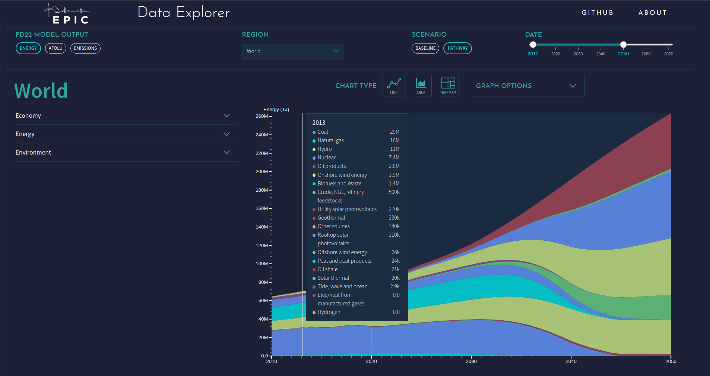

# Positive Disruption Data Explorer

## What is the Positive Disruption Data Explorer?
The Positive Disruption model examines low- and no-carbon technologies and practices in the energy, agriculture, and land-use sectors, modeling how adoption of these technologies and practices can be expected to grow over the next 30 years, and the effect they will have on the process of reversing climate change.

The Positive Disruption Data Explorer is a web-based tool that allows for easy navigation through model results.

## Documentation
Additional documentation is located in our [Wiki](https://github.com/Epic-Institute/data-explorer/wiki).

## How to run the Data Explorer in your web browser
Go to https://epic-institute.github.io/data-explorer/

## How to run the Data Explorer on your local machine
- Open a terminal and navigate to this directory `cd data-explorer`
- Start a Python server `python3 -m http.server XXXX`, where `XXXX` is the port number (e.g. 8100).
- Open a new tab on your favorite web browser and enter `http://localhost:XXXX`

## How to contribute
Please submit pull requests for any bugs identified and/or fixed, as well as new feature suggestions.

## Feedback
Feedback in the form of suggested improvements to the data or code are welcome, just submit a pull request.

Feel free to share any other feedback on our [Discussions page](https://github.com/Epic-Institute/data-explorer/discussions).

## Copyright
Copyright (c) 2022 Epic Institute

## License
See our <b>License</b> file